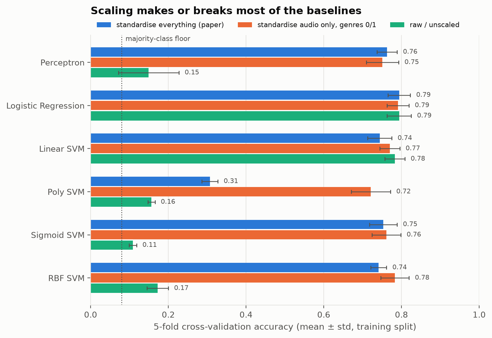
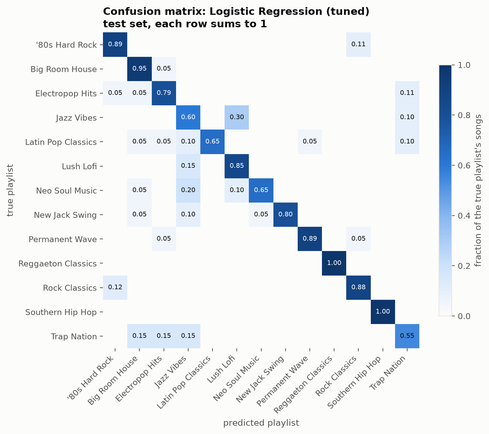
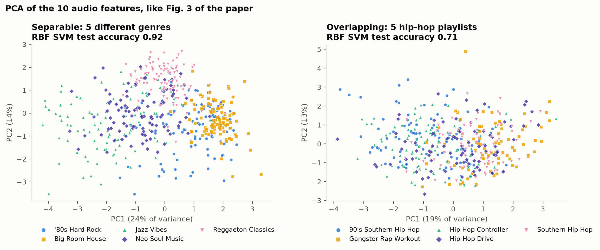

# Training a Playlist Curator Based on User Taste

UE24CS352A Machine Learning mini-project, problem #26 (SRNs 331 & 349).

Reference paper: A. Awadelkarim and K. Coelho, *Training a Playlist Curator Based on User Taste*,
Stanford CS229, 2018. [report](https://cs229.stanford.edu/proj2018/report/22.pdf) ·
[poster](https://cs229.stanford.edu/proj2018/poster/22.pdf)

**The problem.** Given a set of playlists and a new song, which playlist does the song belong in?
Every playlist is a class and every song is a data point described by Spotify's audio features
(danceability, energy, tempo, ...) plus one-hot genre tags of its artist. So it's a multi-class
classification problem.

## Quick start

```bash
python -m venv .venv
.venv\Scripts\activate          # Windows  (macOS/Linux: source .venv/bin/activate)
pip install -r requirements.txt

python run_person_a.py          # data -> baselines -> evaluation -> figures  (~1 minute)
python -m pytest -q             # sanity checks on the data pipeline
```

Everything the script prints is also written to `results/summary.md` and `results/metrics.json`,
and all the plots go into `figures/`.

## Data

The paper pulled its data straight from the Spotify Web API. We can't do that anymore: Spotify
switched off the audio-features endpoint for new apps in November 2024. So we use public datasets
that were collected from the same API, with the same features the paper used:

| file | what | source |
|---|---|---|
| `data/raw/spotify_songs.csv` | 32,833 (song, playlist) rows from 471 real Spotify playlists, with audio features | Kaggle "30000 Spotify Songs" ([TidyTuesday mirror](https://github.com/rfordatascience/tidytuesday/tree/master/data/2020/2020-01-21)) |
| `data/raw/data_w_genres.csv` | 28,680 artists with their Spotify genre tags | Kaggle "Spotify Dataset 1921-2020, 160k+ tracks" (`data_w_genres.csv`) |
| `data/raw/paper_toy_playlists.json` | the paper's own 13 playlists and their tracks | the authors' repo, [kevin-coelho/playlistr-ml-v1](https://github.com/kevin-coelho/playlistr-ml-v1/tree/master/get_toy_set/results) |
| `data/raw/paper_toy_tracks.csv` | those tracks matched to audio features (built by `scripts/build_paper_toy.py`) | see the script's docstring |

**Main dataset: 13 playlists, 1,256 songs.** We used 13 playlists because that's how many the
paper's "toy set" had. We picked them to cover different moods and genres, and kept a few
pairs that we expected to be hard to tell apart (Jazz Vibes vs Lush Lofi, '80s Hard Rock vs Rock
Classics, Southern Hip Hop vs Trap Nation), the same way the paper had Swagger vs Kitchen Swagger.
*Jazz Vibes* is literally the same Spotify playlist the paper used. The list is in `src/config.py`.

Cleaning (`src/data.py`):
- dropped rows with missing audio features (none for our playlists)
- dropped duplicate songs inside a playlist, including the same song under two track IDs (4 rows)
- dropped songs that appear in more than one of our playlists (12 songs / 24 rows). For a
  single-label classifier the same input with two different labels is just noise.
- attached each song's artist genre tags. 80% of songs got at least one tag, and there are
  388 distinct tags across the 13 playlists.

We deliberately **don't** use the `playlist_genre` / `playlist_subgenre` columns from the
Kaggle file. Those describe the playlist, so using them as features would leak the label.

The **split** is a stratified 80/20 split with seed 42 (1,004 train / 252 test). It's saved in the
`split` column of `data/processed/*.csv`, so every model in the project is scored on the same
test songs.

## Features and preprocessing

`x = [10 audio features | one-hot genre tags]`, the same layout as the paper (`src/features.py`).
The genre vocabulary and the scaler are fitted **inside** a scikit-learn pipeline, so during
cross-validation they only ever see the training fold.

We compare three preprocessing options:

- `all`: standardise every column, which is what the paper did
- `audio`: standardise the 10 audio features but keep the genre one-hots as 0/1
- `none`: raw features

## Results (Person A part: baselines, evaluation, PCA)

**Scaled vs unscaled**, 5-fold CV accuracy on the training split (our version of the paper's Table 1):

| model | scale `all` (paper) | scale `audio` | unscaled | paper: scaled / unscaled |
|---|---|---|---|---|
| Perceptron | 0.76 | 0.75 | 0.15 | 0.76 / 0.13 |
| Logistic regression | 0.79 | 0.79 | 0.79 | - |
| Linear SVM | 0.74 | 0.77 | 0.78 | - |
| Poly SVM | 0.31 | 0.72 | 0.16 | 0.17 / 0.48 |
| Sigmoid SVM | 0.75 | 0.76 | 0.11 | 0.74 / 0.09 |
| RBF SVM | 0.74 | 0.78 | 0.17 | 0.77 / 0.25 |
| *majority class* | *0.08* | | | |



What we take from it:
- Scaling is make-or-break for the perceptron and the sigmoid/RBF SVMs. This matches the paper.
- Logistic regression and the linear SVM barely care. They're linear models, and here most of
  the useful signal is in the 0/1 genre columns, which are already on a sensible scale. Scaling
  mostly changes how the regulariser treats each column, not what the model can learn.
- Standardising the one-hot genre columns hurts the kernel SVMs. A tag that only 2 songs out of
  1,000 have turns into a value of about 22 after scaling, which wrecks distances. Keeping genres
  as 0/1 (`audio`) fixes the poly SVM (0.31 → 0.72) and helps RBF (0.74 → 0.78). The paper
  didn't try this.
- The genre tags carry most of the signal: with audio features alone, every model is stuck
  around 0.29-0.43 (`results/table2_genre_ablation.csv`).

**Tuned baselines on the held-out test set:**

| model | chosen by 5-fold CV | CV acc | test acc |
|---|---|---|---|
| Logistic regression | C = 0.1, scale `all` | 0.806 | **0.806** |
| RBF SVM | C = 10, γ = 0.03, scale `audio` | 0.790 | 0.782 |

The best baseline is picked on the CV score, not the test score. Logistic regression gets
**0.806 test accuracy and 0.811 macro F1**. The paper's tuned RBF SVM got 0.80 ± 0.05 on its
own playlists.



- **Easiest playlists:** Reggaeton Classics and Southern Hip Hop (F1 = 1.00), Permanent Wave (0.92).
- **Hardest playlists:** Jazz Vibes (0.52) and Trap Nation (0.59). The biggest single confusion
  is Jazz Vibes → Lush Lofi (30%), which is exactly the pair we expected to be hard.
- **Missing tags cause most mistakes.** Songs whose artist has no genre tags are misclassified
  42% of the time, versus 13% for tagged songs. 19 of the 22 songs wrongly put into Jazz Vibes or
  Lush Lofi had no tags. Those two playlists are mostly small lofi producers with no tags, so
  the model partly learned "no tags → lofi".

**Separable vs overlapping playlists** (our version of the paper's Fig. 3, Jacob vs Myles):



Five playlists from different genres reach 0.92 test accuracy. Five hip-hop playlists only reach
0.71, and the PCA shows why: they sit on top of each other.

**Sanity check on the paper's own playlists.** We could match 528 of the paper's 1,027 tracks to
audio features, so this set is about half the size and unbalanced (Celtic Punk and Tender only
have 15 songs each). We get the same pattern: unscaled perceptron and RBF/sigmoid SVMs collapse to
about 0.15-0.17. A tuned RBF SVM reaches 0.67 test accuracy, lower than the paper's 0.80, which
we put down to having half the data.

All tables are in `results/` and all figures in `figures/`:

| figure | |
|---|---|
| `01_class_balance.png` | songs per playlist and genre-tag coverage |
| `02_feature_scales.png` | raw feature ranges vs standardised (why scaling matters) |
| `03_feature_correlation.png` | correlations between audio features |
| `04_scaled_vs_unscaled.png` | Table 1 as a chart |
| `05_confusion_matrix.png` | best baseline, test set |
| `06_per_playlist_scores.png` | precision / recall / F1 per playlist |
| `07_pca_main.png`, `07b_...` | PCA of all 13 playlists (audio only / audio + genres) |
| `08_pca_easy_vs_hard.png` | separable vs overlapping playlist sets |
| `09_paper_toy_scaled_vs_unscaled.png` | Table 1 on the paper's own playlists |

## Using the data in the other parts of the project

The neural network, the extension, and the demo should all start from the processed files, so
that everyone uses the same cleaning, features and test split:

```python
from src.data import load_processed
from src.features import make_features, make_model

df = load_processed("main")                    # or "easy", "hard", "paper_toy"
train, test = df[df.split == "train"], df[df.split == "test"]

feats = make_features(scale="all")             # fit on train only
X_train = feats.fit_transform(train)
X_test = feats.transform(test)
y_train, y_test = train["playlist"], test["playlist"]
```

Or wrap any scikit-learn classifier, for example
`make_model(MLPClassifier(...), scale="all").fit(train, train.playlist)`.
The fitted pipeline can be pickled for the demo app.

## Repository layout

```
run_person_a.py          data -> baselines -> evaluation -> figures
src/config.py            playlists, features, seed, paths (shared by everyone)
src/data.py              loading, cleaning, genre tags, train/test split
src/features.py          feature pipeline (audio + one-hot genres, scaling options)
src/baselines.py         perceptron, logistic regression, SVMs; CV and grid search
src/evaluate.py          per-playlist metrics, confusion matrix
src/plots.py             all figures
scripts/build_paper_toy.py   rebuilds the paper's own 13-playlist set
tests/                   pytest checks for the data pipeline
data/raw, data/processed, results/, figures/
```

## Who did what

- **Person A (SRN 331/349):** data collection and cleaning, preprocessing, baseline models
  (perceptron, logistic regression, SVMs), evaluation, PCA and plots.
- **Person B:** 1-hidden-layer neural network, extension, demo app.

## Notes and limitations

- The datasets are third-party dumps of Spotify API data. Both are widely used on Kaggle, but
  we couldn't verify them against the live API.
- Genre tags come from matching artist *names* (the Kaggle songs file has no artist IDs), and
  20% of songs end up with no tags at all. As shown above, that's where most errors come from.
- The paper's toy set can only be partly rebuilt (about 51% of tracks), so we treat it as a
  sanity check rather than our main result.
